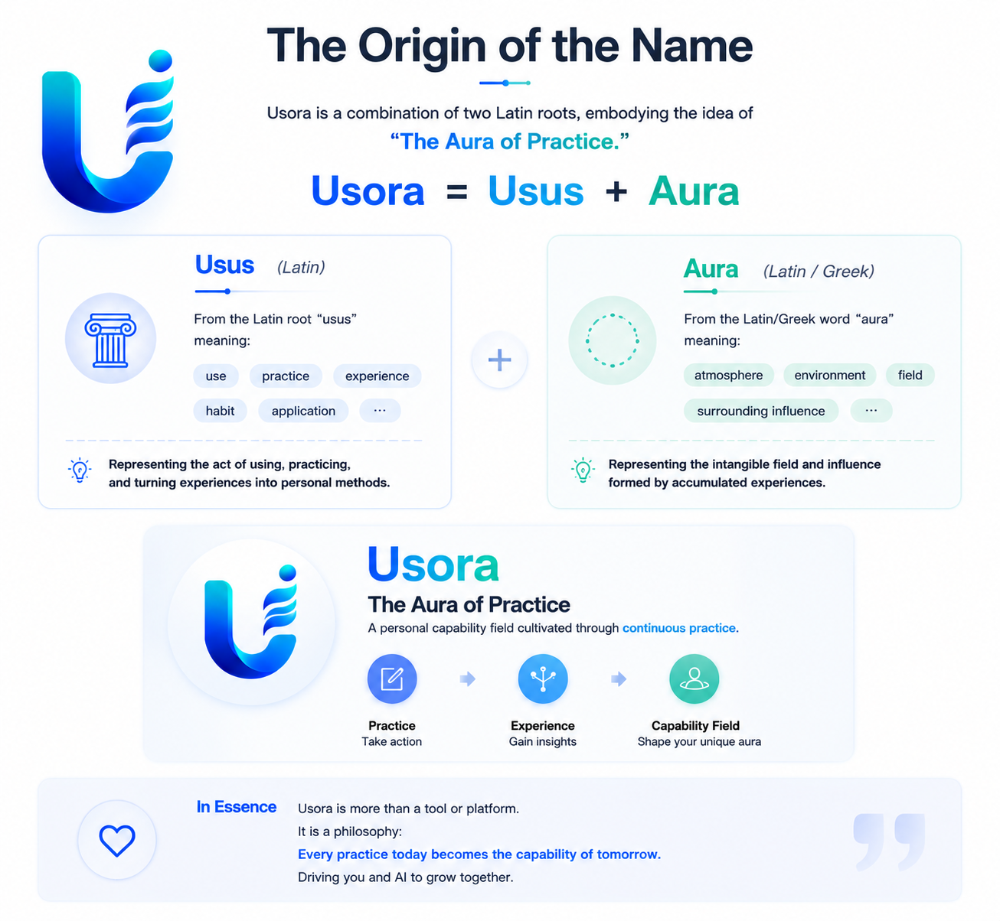

<p align="center">
  
</p>

<p align="center">
  <strong>Usora for Codex</strong><br>
  Turn practice into reusable AI capability.
</p>

<p align="center">
  <a href="../README.md">Project README</a> ·
  <a href="README.zh-CN.md">中文</a>
</p>

# Usora Plugin

Usora is a Codex and CodeBuddy plugin for building a personal capability layer from everyday AI work. The name combines _usus_ (practice, usage, experience) with _aura_ (an invisible field of influence): the capability field created by accumulated practice. It records useful AI work as Activities, promotes reusable patterns into Candidates, and helps a configured Maintainer publish Skills.

<p align="center">
  
</p>

## Core Flow

```text
Activity -> Candidate -> Skill Draft -> Evaluation -> Publish
```

<p align="center">
  
</p>

## Capabilities

- Initialize local Usora storage.
- Merge Activity captures by session.
- Create and evaluate Candidates.
- Configure Maintainer and automation policy.
- Create, evaluate, publish, and revise Skills in place.
- List recent Activities, Candidates, Skills, and lifecycle events.
- Read one Skill by name.
- Check local Hub health.
- Preview or delete old installed Usora plugin cache versions.
- Archive processed Activities.

## Quick Start

Use the Usora MCP tools through Codex or CodeBuddy. No Python, database, or separate CLI installation is required.

Codex shows up to three `defaultPrompt` entries in the plugin UI. Usora uses those slots for the first-run loop: initialize the Hub, capture the current session, and clean old plugin cache after upgrades.

For a 60-second first run, start with:

```text
Initialize my Usora
Show Usora status
Capture this session
```

You should see the local Hub path, Activity/Candidate/Skill counts, and a next useful action.

## Prompt Gallery

Setup and status:

```text
Initialize my Usora
Initialize my Usora Skill Hub
Show Usora status
Show my Skill Hub status
Where is my Usora data?
Move my Usora data to <path>
Check my Skill Hub health
```

Activity capture:

```text
Capture this session
Capture this session into Usora
Capture this task
Record this work as a Usora Activity
Show recent Activities
```

Candidate review:

```text
Show recent Candidates
Create a Candidate
Create a Candidate from this reusable pattern
Evaluate this Candidate
```

Skill lifecycle:

```text
Create a Skill draft
Evaluate this Skill
Publish this Skill
Evaluate and publish this Skill
Show recent Skills
Show this Skill
```

Maintenance:

```text
Show recent Usora events
Clean up generated Activities
Clean old Usora plugin cache
Clean everything
```

## Installation

Codex:

```powershell
codex plugin marketplace add https://github.com/LuoMingxiang/usora.git
codex plugin add usora@usora
```

CodeBuddy:

```powershell
codebuddy plugin marketplace add https://github.com/LuoMingxiang/usora.git
codebuddy plugin install usora@usora
```

During local development, test the plugin directly:

```powershell
codebuddy --plugin-dir .
```

Codex loads Usora through `.codex-plugin/plugin.json`, which declares `mcpServers: "./.codex-plugin/mcp.json"`. That MCP config uses `${PLUGIN_ROOT}`.

CodeBuddy loads Usora through `.codebuddy-plugin/plugin.json`, which declares `skills` and `mcpServers: "./.codebuddy-plugin/mcp.json"`. That MCP config uses `${CODEBUDDY_PLUGIN_ROOT}` so the VS Code extension does not resolve `scripts/usora-mcp.mjs` relative to the VS Code install directory. After loading, try:

```text
Show Usora status
Capture this session into Usora
```

Manual MCP fallback for hosts that support MCP but not plugin marketplaces:

```json
{
  "mcpServers": {
    "usora": {
      "command": "node",
      "args": ["scripts/usora-mcp.mjs"],
      "cwd": "/absolute/path/to/usora"
    }
  }
}
```

## Data

The default data directory is `<cwd>/.usora`. The `USORA_HOME` environment variable is not supported.

To move data elsewhere, call `hub_config` with a `path` argument, either absolute or relative to the workspace. Usora moves existing records into the new directory, clears the old record folders, and persists the new location in `config.json` as `hub_path`.

`hub_status` reports both the resolved `hub` directory and `config_path`.
It also returns `next_action`, a small lifecycle hint:

```text
capture_activity -> Capture this session
create_candidate -> Create a Candidate
create_skill -> Create a Skill draft
review_or_cleanup -> Review Skills or clean processed Activities
```

A human-readable status summary should keep this order:

```text
Usora Hub
Status: initialized
Data: <hub>
Config: <config_path>
Maintainer: <config.maintainer>
Policy: <config.automation_policy>

Records
Activities: <activities>
Candidates: <candidates>
Skills: <skills>

Next useful action: <next_action label>
```

```text
<hub>/
├── activities/
├── candidates/
├── skills/
├── archive/
└── events/

<cwd>/.usora/config.json   # config file
```

If the host does not provide a stable `session_id`, Usora generates a process-scoped ID with a time-ordered prefix and 128-bit random salt so repeated captures in one MCP process update one Activity.

## Upgrading and Uninstalling

Codex and CodeBuddy install plugins into their local plugin caches and load the installed copy, not the live source directory. For Usora, the marketplace entry points at GitHub `master`, so local changes only become installable after they are committed and pushed.

If a new Usora build is not visible after pulling or pushing changes, use this release loop:

1. Finish the plugin change locally.
2. Choose the release version:
   - `patch`: fixes, docs, copy, metadata, small compatible improvements.
   - `minor`: new compatible MVP capability or visible workflow improvement.
   - `major`: breaking storage, tool, or Skill contract change. Usora should usually stay in `0.x` during MVP.

3. Run the release helper from the repo root:

   ```text
   ./scripts/release-usora-plugin.ps1
   ```

   The helper bumps the plugin SemVer patch version by default, validates the plugin manifest, and runs the Node MCP tests.

   Use `-Bump minor` or `-Bump major` when needed:

   ```text
   ./scripts/release-usora-plugin.ps1 -Bump minor
   ```

   To set an exact version:

   ```text
   ./scripts/release-usora-plugin.ps1 -Version 0.2.0
   ```

4. Review the diff.
5. Commit and push the plugin changes.
6. Open `/plugins`, find Usora, and upgrade or reinstall it.
7. Refresh or restart Codex and open a new task if older MCP tools still appear.
8. After the new version is installed, clean old Usora cache directories if needed through the Usora MCP tool:

   ```text
   Clean old Usora plugin cache
   ```

   The tool defaults to a dry run. Confirm deletion only after it lists the old versions you expect.

   Developers can also use the local helper:

   ```text
   ./scripts/cleanup-usora-plugin-cache.ps1
   ./scripts/cleanup-usora-plugin-cache.ps1 -HostName all
   ./scripts/cleanup-usora-plugin-cache.ps1 -Apply
   ```

   The first two commands are dry runs. The `-Apply` command removes old installed Usora cache versions for the selected host and keeps the currently released version. Use `-HostName codex`, `-HostName codebuddy`, or `-HostName all`.

To do the release commit and push in one run:

```text
./scripts/release-usora-plugin.ps1 -Commit -Push
```

Use this after reviewing or when the change is already ready to publish. It bumps the patch version, validates, tests, commits the plugin metadata/runtime files and the release helper, then pushes. Add `-Bump minor` or `-Version 0.2.0` before `-Commit -Push` for larger releases.

Codex handles plugin removal. Use `Uninstall plugin` in the `/plugins` browser.

Because Usora includes a local MCP server, Codex may ask you to disable Usora before uninstalling it. Disabling first removes Usora's tools from the callable set before the cached plugin bundle is removed. Pure Skill-only plugins may be able to uninstall directly.

From a terminal, remove the installed plugin with:

```text
codex plugin remove usora@usora
```

`codex plugin marketplace remove <marketplace-name>` removes a configured marketplace source. It is not the normal per-plugin uninstall path.

After upgrading or uninstalling an MCP-backed plugin, refresh or restart Codex and open a new task if older tools still appear.

### Upgrade Troubleshooting

If the plugin UI says upgrade failed but the version changed, treat it as a partial UI/reload failure rather than a broken Usora install. Check these signals:

```text
~/.codex/plugins/cache/usora/usora/<new-version> exists
The plugin details page shows <new-version>
A new task can see the expected Usora tools
```

When those are true, the install succeeded and the failed step was likely Codex refreshing the enabled MCP server or current task tool schema. Open a new task, then run `Clean old Usora plugin cache` if old versions remain.

Uninstalling the plugin does **not** remove local Usora data.

To clean data:

1. Run `hub_status` to locate `hub` and `config_path`.
2. Run `hub_cleanup` with `mode: all` and `confirm: true`.
3. Delete the now-empty data directory manually if you also want the directory removed.

## MVP Boundary

Usora is currently a local, single-user MVP. It does not include a Web UI, cloud sync, team collaboration, a public Skill marketplace, or direct AI-to-AI communication.

## Design Boundary

The plugin owns storage, lifecycle, roles, and state progression. AI-specific integrations should normalize sessions into Activities and must not implement Skill business logic.
