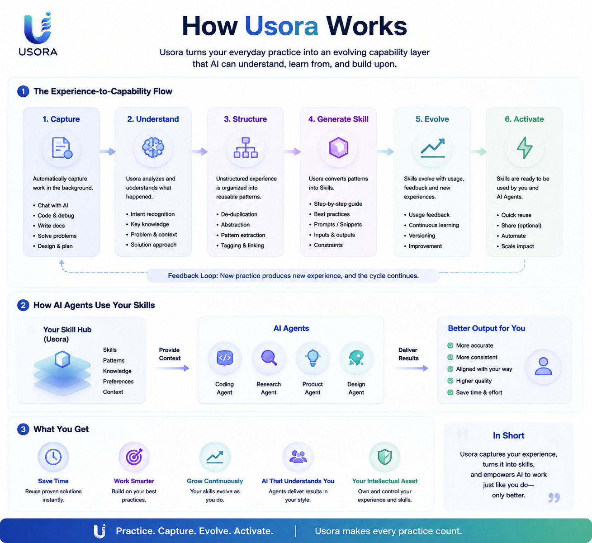

<p align="center">
  
</p>

<p align="center">
  <strong>Usora for Codex</strong><br>
  Turn practice into reusable AI capability.
</p>

<p align="center">
  <a href="../README.md">Project README</a> ·
  <a href="plugin.zh-CN.md">中文</a>
</p>

# Usora Plugin

Usora is a Codex and CodeBuddy plugin for building a personal capability layer from everyday AI work. The name combines _usus_ (practice, usage, experience) with _aura_ (an invisible field of influence): the capability field created by accumulated practice. It records useful AI work as Activities, promotes reusable patterns into Candidates, and helps a configured Maintainer publish Skills.

<p align="center">
  
</p>

## Core Flow

```text
Activity -> Candidate -> Skill Draft -> Evaluation -> Publish
```

<p align="center">
  
</p>

## Capabilities

- Initialize local Usora storage.
- Merge Activity captures by session.
- Query compact Activity digests and resolve Candidates with local duplicate checks.
- Create and evaluate Candidates.
- Configure Maintainer and automation policy.
- Generate Skill drafts from approved Candidates, then evaluate and publish Skills in place.
- Query Activities, Patterns, Candidates, and Skills with compact defaults.
- Read one full Activity or Skill only when needed.
- Inspect telemetry metrics and lifecycle events.
- Check local Hub health.
- Preview or delete old installed Usora plugin cache versions.
- Archive processed Activities.

## Quick Start

Use the Usora MCP tools through Codex or CodeBuddy. No Python, database, or separate CLI installation is required.

Codex shows up to three `defaultPrompt` entries in the plugin UI. Usora uses those slots for the first-run loop: initialize the Hub, capture the current session, and clean old plugin cache after upgrades.

For a 60-second first run, start with:

```text
Initialize my Usora
Show Usora status
Capture this session
```

You should see the local Hub path, Activity/Candidate/Skill counts, and a next useful action.

## Prompt Gallery

Setup and status:

```text
Initialize my Usora
Initialize my Usora Skill Hub
Show Usora status
Show my Skill Hub status
Where is my Usora data?
Move my Usora data to <path>
Check my Skill Hub health
```

Activity capture:

```text
Capture this session
Capture this session into Usora
Capture this task
Record this work as a Usora Activity
Show recent Activities
```

Candidate review:

```text
Show recent Candidates
Create a Candidate
Create a Candidate from this reusable pattern
Evaluate this Candidate
```

Skill lifecycle:

```text
Generate a Skill from an approved Candidate
Create a Skill draft
Evaluate this Skill
Publish this Skill
Evaluate and publish this Skill
Show recent Skills
Show this Skill
```

Maintenance:

```text
Show recent Usora events
Clean up generated Activities
Clean old Usora plugin cache
Clean everything
```

## Installation

Published installs use the generated marketplace distribution, not the source branch. Replace `<git-url-for-marketplace-branch>` with the Git reference your host resolves to the generated `marketplace` branch.

Host-specific guides:

- [Codex usage](usage/codex.md)
- [CodeBuddy usage](usage/codebuddy.md)

Codex:

```powershell
codex plugin marketplace add <git-url-for-marketplace-branch>
codex plugin add usora@foundry
```

CodeBuddy:

```powershell
codebuddy plugin marketplace add <git-url-for-marketplace-branch>
codebuddy plugin install usora@foundry
```

During local development, test the plugin directly:

```powershell
codebuddy --plugin-dir plugins/foundry
```

Codex loads Usora Foundry through `plugins/foundry/.codex-plugin/plugin.json`, which declares `mcpServers: "./.mcp.json"`. Keep `.mcp.json` at the plugin root so Codex resolves the bundled MCP server from the installed plugin.

CodeBuddy loads Usora Foundry through `plugins/foundry/.codebuddy-plugin/plugin.json`, which declares `skills` and `mcpServers: "./.codebuddy-plugin/mcp.json"`. That MCP config uses `${CODEBUDDY_PLUGIN_ROOT}` so the VS Code extension does not resolve `dist/mcp.js` relative to the VS Code install directory. After loading, try:

```text
Show Usora status
Capture this session into Usora
```

Manual MCP fallback for hosts that support MCP but not plugin marketplaces:

```json
{
  "mcpServers": {
    "practice": {
      "command": "node",
      "args": ["dist/mcp.js"],
      "cwd": "/absolute/path/to/usora/plugins/foundry"
    }
  }
}
```

For contributor-facing platform details, including scaffolding, manifest ownership, distribution modes, and host adapter rules, see [Plugin platform notes](plugin/create/README.md).

## Data

Usora keeps raw practice local to each AI host and shares only distilled knowledge. Session and Activity records stay in the stable host directory: `~/.codex/plugins/data/usora/.usora` for Codex and `~/.codebuddy/plugins/data/usora/.usora` for CodeBuddy. Patterns, Candidates, Skills, skill indexes, events, and usage records live in the shared Knowledge Home, which defaults to `~/.usora`. Local/manual MCP runs fall back to `<cwd>/.usora`. Set `USORA_HOME` to override the shared Knowledge Home.

### Foundry Knowledge Architecture

The storage boundary is:

```text
Host Practice
- sessions
- activities

Shared Knowledge
- indexes/patterns.json
- candidates
- skills
- usage
- events
- backups
```

During distillation, Foundry discovers registered Activity Sources, reads available host Activity directories, normalizes provenance, and merges evidence into shared Patterns. Add a new AI by adding an Activity Source that resolves its Usora Activity directory and returns fingerprinted Activity records; the Pattern, Candidate, and Skill pipeline does not need host-specific branches.

Migration keeps Sessions and Activities in their host directories. It merges legacy Patterns by fingerprint, copies non-conflicting Candidates and Skills into Knowledge Home, deduplicates identical Skills, and writes a migration report for conflicts instead of overwriting.

Usora Foundry 2.0 uses Hub schema v2. v1 Hubs are never silently migrated: `hub_init`, `hub_status`, and `hub_doctor` report `migration_required` when a v1 Hub is detected, and write tools reject new v2 records until migration completes. Run `hub_migrate` without `confirm` for a dry run, then run `hub_migrate` with `confirm: true` to create a backup under `<hub>/backups/`, update host-local Activity schema in place, and merge old Patterns, Candidates, and Skills into the shared Knowledge Home. Sessions and Activities are not moved into shared knowledge.

Legacy `activity_list`, `candidate_list`, and `skill_list` are deprecated. Prefer `activity_query`, `candidate_query`, and `skill_query`; these default to compact digest/metadata results. Use `activity_get` or `skill_get` only when full records or Markdown content are required.

To move host-local practice data elsewhere, call `hub_config` with a `path` argument, either absolute or relative to the workspace. Usora moves host-owned records into the new directory, clears the old record folders, and persists the new location in `config.json` as `hub_path`. To move shared knowledge, set `USORA_HOME`.

`hub_status` is the source of truth for storage questions. It reports the resolved host-local `hub`/`data_path`, shared `knowledge_path`, `config_path`, Practice paths, Knowledge paths, path resolution source, and registered Activity Source availability.
It also returns `next_action`, a small lifecycle hint:

```text
capture_activity -> Capture this session
create_candidate -> Create a Candidate
create_skill -> Create a Skill draft
review_or_cleanup -> Review Skills or clean processed Activities
```

A human-readable status summary should keep this order:

```text
Usora Hub
Status: initialized
Data: <hub>
Data path: <data_path>
Config: <config_path>
Maintainer: <config.maintainer>
Policy: <config.automation_policy>

Records
Activities: <activities>
Candidates: <candidates>
Skills: <skills>

Next useful action: <next_action label>
```

```text
<hub>/
├── activities/
├── candidates/
├── skills/
├── archive/
└── events/

<anchor>/config.json       # config file
```

If the host does not provide a stable `session_id`, Usora generates a process-scoped ID with a time-ordered prefix and 128-bit random salt so repeated captures in one MCP process update one Activity.

## Upgrading and Uninstalling

Codex and CodeBuddy install plugins into their local plugin caches and load the installed copy, not the live source directory. For Usora, published installs resolve the generated marketplace distribution, so local changes only become installable after the release flow packages the plugin and republishes marketplace metadata.

If a new Usora build is not visible after pulling or pushing changes, use this release loop:

1. Finish the plugin change locally.
2. Run `bun run check`.
3. Commit with a Conventional Commit message.
4. Push the source branch.
5. Let the Release workflow run `bun run release:ci --publish`; it calculates the plugin version from Conventional Commits, writes the plugin manifests, packages the artifact, publishes the GitHub Release, and updates the marketplace branch.
6. Open `/plugins`, find Usora, and upgrade or reinstall it.
7. Refresh or restart Codex and open a new task if older MCP tools still appear.
8. After the new version is installed, clean old Usora cache directories if needed through the Usora MCP tool:

   ```text
   Clean old Usora plugin cache
   ```

   The tool defaults to a dry run. Confirm deletion only after it lists the old versions you expect.

Codex handles plugin removal. Use `Uninstall plugin` in the `/plugins` browser.

Because Usora includes a local MCP server, Codex may ask you to disable Usora before uninstalling it. Disabling first removes Usora's tools from the callable set before the cached plugin bundle is removed. Pure Skill-only plugins may be able to uninstall directly.

From a terminal, remove the installed plugin with:

```text
codex plugin remove usora@foundry
```

`codex plugin marketplace remove <marketplace-name>` removes a configured marketplace source. It is not the normal per-plugin uninstall path.

After upgrading or uninstalling an MCP-backed plugin, refresh or restart Codex and open a new task if older tools still appear.

### Upgrade Troubleshooting

If the plugin UI says upgrade failed but the version changed, treat it as a partial UI/reload failure rather than a broken Usora install. Check these signals:

```text
~/.codex/plugins/cache/usora/usora/<new-version> exists
The plugin details page shows <new-version>
A new task can see the expected Usora tools
```

When those are true, the install succeeded and the failed step was likely Codex refreshing the enabled MCP server or current task tool schema. Open a new task, then run `Clean old Usora plugin cache` if old versions remain.

Uninstalling the plugin does **not** remove local Usora data.

To clean data:

1. Run `hub_status` to locate `hub` and `config_path`.
2. Run `hub_cleanup` with `mode: all` and `confirm: true`.
3. Delete the now-empty data directory manually if you also want the directory removed.

## MVP Boundary

Usora is currently a local, single-user MVP. It does not include a Web UI, cloud sync, team collaboration, a public Skill marketplace, or direct AI-to-AI communication.

## Related Guides

- [Hooks: Automatic session activity recording](plugin/hooks.md)
- [Plugin platform notes](plugin/create/README.md)

## Design Boundary

The plugin owns storage, lifecycle, roles, and state progression. AI-specific integrations should normalize sessions into Activities and must not implement Skill business logic.
