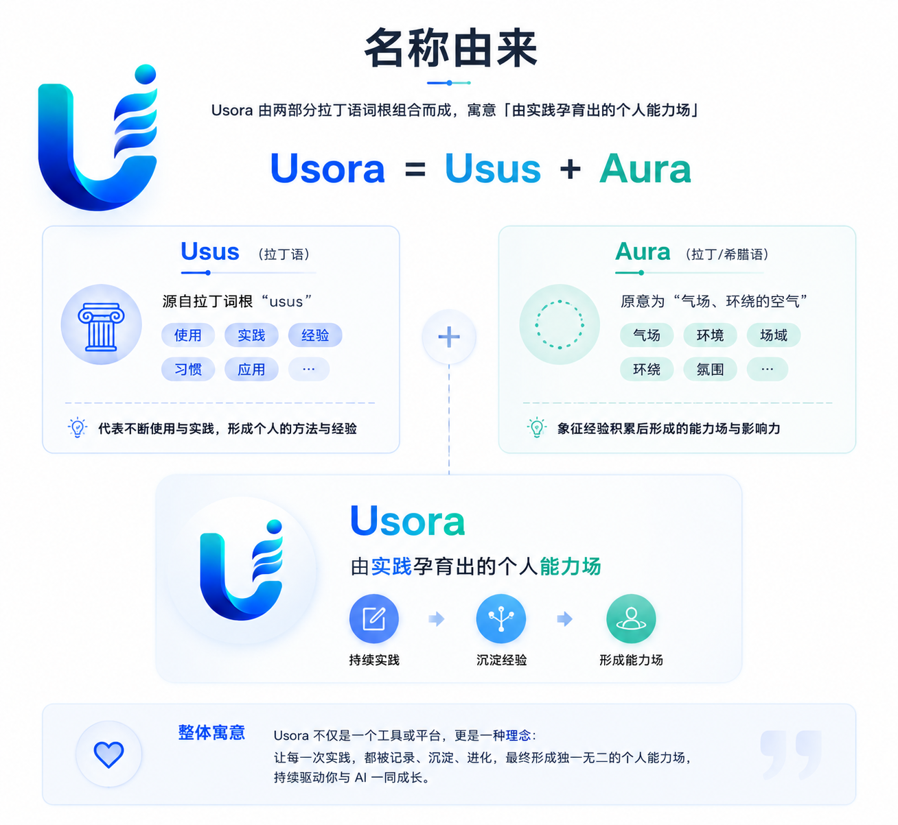
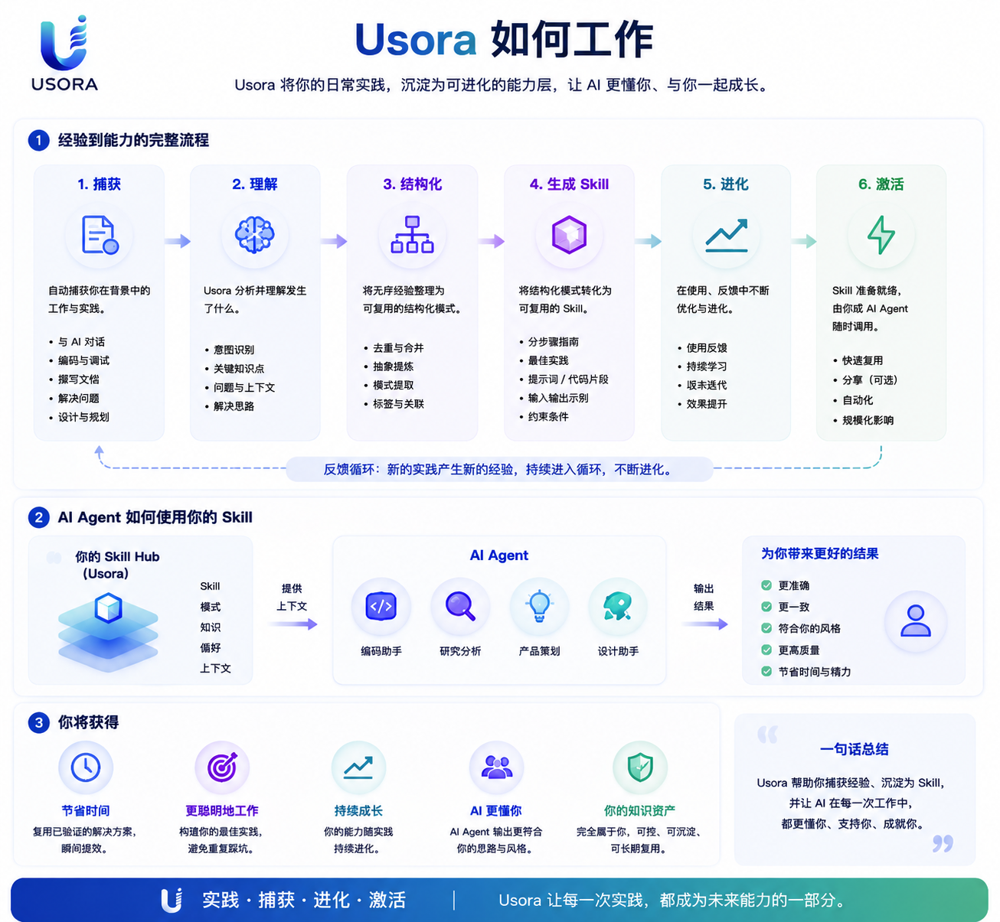

<p align="center">
  
</p>

<p align="center">
  <strong>Usora for Codex</strong><br>
  把实践转化为可复用的 AI 能力。
</p>

<p align="center">
  <a href="plugin.md">English</a> ·
  <a href="../README.zh-CN.md">项目 README</a>
</p>

# Usora 插件

Usora 是一个 Codex 和 CodeBuddy 插件，用来把日常 AI 工作沉淀为个人能力层。Usora 由 _usus_（practice, usage, experience）和 _aura_（invisible field of influence）组成，意为由累积实践形成的 capability field。它把有价值的 AI 工作记录为 Activities，把可复用模式提升为 Candidates，并帮助配置好的 Maintainer 发布 Skills。

<p align="center">
  
</p>

## 核心流程

```text
Activity -> Candidate -> Skill Draft -> Evaluation -> Publish
```

<p align="center">
  
</p>

## 能力

- 初始化本地 Usora 存储。
- 按 session 合并 Activity 记录。
- 查询紧凑 Activity digest，并用本地重复检查解析 Candidate。
- 创建并评估 Candidates。
- 配置 Maintainer 和自动化策略。
- 从已通过评估的 Candidate 生成 Skill 草稿，再评估、发布并原地修订 Skills。
- 使用紧凑默认值查询 Activities、Patterns、Candidates 和 Skills。
- 仅在必要时读取完整 Activity 或 Skill Markdown。
- 查看 telemetry metrics 和生命周期事件。
- 检查本地 Hub 健康状态。
- 预览或删除旧版本 Usora 插件安装缓存。
- 归档已处理 Activities。

## 快速开始

通过 Codex 或 CodeBuddy 使用 Usora MCP tools。无需安装 Python、数据库或独立 CLI。

Codex 插件 UI 最多展示三条 `defaultPrompt`。Usora 会把这三个位置用于首次闭环：初始化 Hub、捕获当前 session，以及升级后清理旧插件缓存。

60 秒首次体验可以从这些句子开始：

```text
Initialize my Usora
Show Usora status
Capture this session
```

你应该看到本地 Hub 路径、Activity/Candidate/Skill 数量，以及下一步建议。

## Prompt Gallery

初始化与状态：

```text
Initialize my Usora
Initialize my Usora Skill Hub
Show Usora status
Show my Skill Hub status
Where is my Usora data?
Move my Usora data to <path>
Check my Skill Hub health
```

Activity 捕获：

```text
Capture this session
Capture this session into Usora
Capture this task
Record this work as a Usora Activity
Show recent Activities
```

Candidate 评审：

```text
Show recent Candidates
Create a Candidate
Create a Candidate from this reusable pattern
Evaluate this Candidate
```

Skill 生命周期：

```text
Generate a Skill from an approved Candidate
Create a Skill draft
Evaluate this Skill
Publish this Skill
Evaluate and publish this Skill
Show recent Skills
Show this Skill
```

维护：

```text
Show recent Usora events
Clean up generated Activities
Clean old Usora plugin cache
Clean everything
```

## 安装

宿主使用指南：

- [Codex 使用指南](usage/codex.zh-CN.md)
- [CodeBuddy 使用指南](usage/codebuddy.zh-CN.md)

Codex:

```powershell
codex plugin marketplace add https://github.com/LuoMingxiang/usora.git
codex plugin add usora@foundry
```

CodeBuddy:

```powershell
codebuddy plugin marketplace add https://github.com/LuoMingxiang/usora.git
codebuddy plugin install usora@foundry
```

本地开发时可以直接加载插件：

```powershell
codebuddy --plugin-dir plugins/foundry
```

Codex 会通过 `plugins/foundry/.codex-plugin/plugin.json` 加载 Usora Foundry；其中显式声明 `mcpServers: "./.mcp.json"`。`.mcp.json` 保持在插件根目录，让 Codex 从已安装插件中解析 bundled MCP server。

CodeBuddy 会通过 `plugins/foundry/.codebuddy-plugin/plugin.json` 加载 Usora Foundry；其中显式声明 `skills` 和 `mcpServers: "./.codebuddy-plugin/mcp.json"`。这个 MCP 配置使用 `${CODEBUDDY_PLUGIN_ROOT}`，避免 VS Code 插件把 `scripts/usora-mcp.mjs` 解析到 VS Code 安装目录。加载后可以试：

```text
Show Usora status
Capture this session into Usora
```

如果宿主支持 MCP 但不支持插件市场，可以手动配置 MCP：

```json
{
  "mcpServers": {
    "practice": {
      "command": "node",
      "args": ["scripts/usora-mcp.mjs"],
      "cwd": "/absolute/path/to/usora/plugins/foundry"
    }
  }
}
```

## 数据

默认数据目录会跨插件升级保持稳定：Codex 使用 `~/.codex/plugins/data/usora/.usora`，CodeBuddy 使用 `~/.codebuddy/plugins/data/usora/.usora`。本地/手动 MCP 运行时 fallback 到 `<cwd>/.usora`。目前不支持 `USORA_HOME` 环境变量。

Usora Foundry 2.0 使用 Hub schema v2。v1 Hub 不会被静默迁移：`hub_init`、`hub_status` 和 `hub_doctor` 会在检测到 v1 Hub 时返回 `migration_required`，写入工具会拒绝创建新的 v2 记录，直到迁移完成。先运行不带 `confirm` 的 `hub_migrate` 做 dry run；确认后再运行 `hub_migrate` 并传入 `confirm: true`，它会在 `<hub>/backups/` 下创建备份，然后迁移 Activities、Candidates、Skills 和 config。

旧的 `activity_list`、`candidate_list` 和 `skill_list` 已 deprecated。优先使用 `activity_query`、`candidate_query` 和 `skill_query`；它们默认返回紧凑 digest/metadata。只有需要完整记录或 Markdown 内容时才使用 `activity_get` 或 `skill_get`。

如需移动数据，调用 `hub_config` 并传入 `path`，可以是绝对路径，也可以是相对 workspace 的路径。Usora 会把已有记录移动到新目录，清理旧记录文件夹，并把新位置以 `hub_path` 写入 `config.json`。

`hub_status` 会返回解析后的 `hub` 目录、明确的 `data_path` 和 `config_path`。它也会返回 `next_action`，作为轻量生命周期提示：

```text
capture_activity -> Capture this session
create_candidate -> Create a Candidate
create_skill -> Create a Skill draft
review_or_cleanup -> Review Skills or clean processed Activities
```

人类可读的状态摘要建议保持这个顺序：

```text
Usora Hub
Status: initialized
Data: <hub>
Data path: <data_path>
Config: <config_path>
Maintainer: <config.maintainer>
Policy: <config.automation_policy>

Records
Activities: <activities>
Candidates: <candidates>
Skills: <skills>

Next useful action: <next_action label>
```

```text
<hub>/
├── activities/
├── candidates/
├── skills/
├── archive/
└── events/

<anchor>/config.json       # config file
```

如果宿主没有提供稳定的 `session_id`，Usora 会生成一个进程级 ID，包含时间有序前缀和 128-bit 随机盐。这样同一个 MCP 进程里的重复 capture 会更新同一条 Activity。

## 升级与卸载

Codex 和 CodeBuddy 会把插件安装到本地插件缓存，并加载已安装副本，而不是实时读取源码目录。Usora 的 marketplace entry 指向 GitHub `master`，所以本地变更必须 commit 并 push 后，才会成为可安装版本。

如果 pull 或 push 后看不到新的 Usora build，按这个发布流程走：

1. 在本地完成插件改动。
2. 运行 `bun run check`。
3. 用 Conventional Commit 信息提交。
4. Push 到 `master`。
5. 让 Release workflow 执行 `semantic-release`；它会 bump 版本、同步插件元数据、更新 `CHANGELOG.md`、打 tag，并提交生成文件。
6. 打开 `/plugins`，找到 Usora，然后 upgrade 或 reinstall。
7. 如果旧 MCP tools 仍然出现，刷新或重启 Codex，并打开一个新 task。
8. 新版本安装成功后，如有需要，通过 Usora MCP tool 清理旧 Usora cache 目录：

   ```text
   Clean old Usora plugin cache
   ```

   这个 tool 默认是 dry run。只有当它列出的旧版本符合预期时，再确认删除。

Codex 负责插件移除。可以在 `/plugins` browser 中使用 `Uninstall plugin`。

由于 Usora 包含本地 MCP server，Codex 可能会要求你先 disable Usora 再 uninstall。先 disable 会在删除缓存插件包之前，把 Usora tools 从 callable set 中移除。纯 Skill 插件可能可以直接 uninstall。

也可以从终端移除已安装插件：

```text
codex plugin remove usora@foundry
```

`codex plugin marketplace remove <marketplace-name>` 移除的是已配置的 marketplace source，不是普通的单插件卸载路径。

升级或卸载带 MCP 的插件后，如果旧 tools 仍然出现，刷新或重启 Codex，并打开一个新 task。

### 升级排查

如果插件 UI 提示 upgrade failed，但版本号已经变化，优先把它视为 UI/reload 的局部失败，而不是 Usora 安装损坏。检查这些信号：

```text
~/.codex/plugins/cache/usora/usora/<new-version> exists
插件详情页显示 <new-version>
新 task 能看到预期的 Usora tools
```

如果这些都成立，说明安装已经成功，失败步骤大概率是 Codex 刷新已启用 MCP server 或当前 task tool schema。打开新 task 后，如旧版本仍在，再运行 `Clean old Usora plugin cache`。

卸载插件**不会**删除本地 Usora 数据。

清理数据：

1. 运行 `hub_status` 找到 `hub` 和 `config_path`。
2. 运行 `hub_cleanup`，传入 `mode: all` 和 `confirm: true`。
3. 如果也想删除目录本身，手动删除已经清空的数据目录。

## MVP 边界

Usora 当前是本地、单用户 MVP。它不包含 Web UI、云同步、团队协作、公开 Skill marketplace，或 AI 与 AI 的直接通信。

## 相关指南

- [Hooks：自动记录会话活动](plugin/hooks.zh-CN.md)
- [插件平台说明](plugin/create/README.zh-CN.md)

## 设计边界

插件拥有 storage、lifecycle、roles 和 state progression。AI-specific integrations 应该把 sessions 归一化为 Activities，不应该实现 Skill 业务逻辑。
